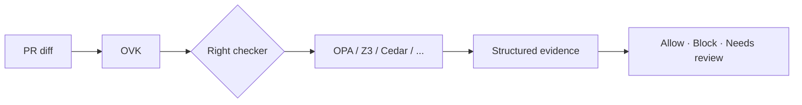

<div align="center">

# Open Verification Kernel

**Give AI-authored pull requests the same kind of evidence a security review would ask for — automatically.**

[](LICENSE)
[](pyproject.toml)
[](docs/benchmarks/latest-leaderboard-summary.json)
[](docs/README.md)

[Quick start](#quick-start) · [Add to CI](#github-actions) · [Contribute](#contribute) · [Documentation](docs/README.md)

</div>

---

Agents now open real pull requests: they edit CI workflows, change auth rules, touch infrastructure, and ship deployment logic. A comment saying *"looks good to me"* is not enough. OVK is the open layer that turns **"what must still be true after this change?"** into checks your pipeline can run, with results reviewers and bots can trust.

OVK does **not** replace the tools you already use (Z3, OPA, Cedar, TLA+, Dafny, Lean, and others). It connects them to everyday PR workflows so every result says clearly: what was checked, what passed, what failed, and what still needs a human.



---

## Why this exists

| Without OVK | With OVK |
|---|---|
| Each formal tool has its own CLI, format, and semantics | One command and one evidence format across tools |
| Agent PRs rely on self-review or generic lint | High-risk changes get targeted, explainable checks |
| "Pass" can hide missing context or wrong assumptions | Every outcome lists assumptions, limits, and unknowns |
| Hard to benchmark agent-generated diffs | [FormalPR-Bench](docs/BENCHMARK.md) scores real PR scenarios |

---

## What OVK guards on every PR

These are the five high-risk change types OVK ships today. Each has examples, tests, and a path from **blocked** to **fixed**.

| Risk | Plain-language rule |
|---|---|
| **Self-protection** | An agent cannot remove or weaken the checks that gate its own merges |
| **Authorization** | Sensitive routes cannot become reachable without proper guards |
| **Infrastructure** | Private or sensitive resources cannot be exposed to the public internet |
| **CI secrets** | Workflow changes cannot leak secrets into untrusted contexts (e.g. fork PRs) |
| **Deployments** | Rollouts cannot skip required approval or rollback safety steps |

Run all of them from a single diff:

```bash
ovk check --changed-files path/to/your.diff
```

When something blocks, OVK can suggest a fix class you can apply and re-run:

```bash
ovk repair-suggest --evidence ovk-evidence.json
```

---

## Quick start

**Requirements:** Python 3.10+

```bash
git clone https://github.com/fraware/open-verification-kernel.git
cd open-verification-kernel
pip install -e '.[dev]'

ovk init
ovk doctor
ovk check --changed-files examples/multi_surface/pr_combined.diff --advisory
```

You should see a recommendation — **allow**, **block**, or **needs human review** — plus artifacts in the working directory:

| File | What it is |
|---|---|
| `ovk-evidence.json` | Machine-readable check results |
| `ovk-pr-comment.md` | Summary you can post on the PR |
| `ovk-evidence-quality.json` | Integrity checks on the evidence itself |

Try a failing then passing repair loop:

```bash
python examples/repair_loops/ci_secrets/demo_repair_loop.py
```

More install paths (PyPI, optional solvers, signing): [docs/INTEGRATION.md](docs/INTEGRATION.md)

---

## GitHub Actions

Add OVK to a pull request workflow. Start in **advisory** mode (reports findings without failing the job); move to **strict** when you trust the signal.

```yaml
name: Verify PR
on:
  pull_request:
    branches: [main]

permissions:
  contents: read
  pull-requests: write
  checks: write   # required when emit-check: true

jobs:
  ovk:
    runs-on: ubuntu-latest
    steps:
      - uses: actions/checkout@v4
      - uses: fraware/open-verification-kernel@v1.2.0
        with:
          mode: advisory          # switch to strict when ready
          use-check: "true"       # analyze the PR diff automatically
          emit-check: "true"      # optional; requires checks: write
          post-comment: "true"    # requires pull-requests: write
```

Copy a full consumer example: [`examples/github_workflows/external_consumer.yml`](examples/github_workflows/external_consumer.yml)

---

## Built for agents and humans

| Surface | Use when |
|---|---|
| **CLI** (`ovk`) | Local debugging, CI runners, scripts |
| **GitHub Action** | Every PR in your org |
| **Agent server** (`ovk-mcp`) | Let coding agents run checks from their tool loop (`pip install '.[mcp]'`) |
| **Templates** ([`templates/`](templates/)) | Reusable rules for common risks (100 included) |
| **Benchmark** (`ovk bench`) | Measure regression on agent-style PR diffs |

Agent repair walkthrough: [docs/AGENT_REPAIR_LOOP.md](docs/AGENT_REPAIR_LOOP.md)

---

## Contribute

OVK is an interoperability project. The most valuable contributions are the ones that make **honest, useful checks** easier to add and harder to fake.

**We especially welcome:**

- New **property templates** for real engineering risks (see [`templates/`](templates/))
- **Checker adapters** with clear "what this proves" documentation
- **PR diff fixtures** that reflect how agents actually change repos
- **Tests** that catch silent passes and misleading evidence

**Get started in three steps:**

```bash
pip install -e '.[dev]'
pytest
ovk release-preflight
```

Then open a PR. Read the full guide: [docs/CONTRIBUTING.md](docs/CONTRIBUTING.md)

**Principles we hold contributors to:**

- Never treat unknown, skipped, or errored checks as success
- Every adapter states its assumptions and what "pass" actually means
- Prefer small, verifiable properties over vague "secure" claims

Questions, ideas, or a first PR — you are welcome. See [docs/ARCHITECTURE.md](docs/ARCHITECTURE.md) for how the pieces fit together.

---

## Documentation

| I want to… | Read |
|---|---|
| See adoption readiness before pinning | [CURRENT_RELEASE_STATUS.md](docs/CURRENT_RELEASE_STATUS.md) |
| Install locally or wire up CI | [INTEGRATION.md](docs/INTEGRATION.md) |
| Tune strictness and checker selection | [POLICY.md](docs/POLICY.md) |
| Understand checkers and fallbacks | [BACKENDS.md](docs/BACKENDS.md) |
| Run or extend the benchmark | [BENCHMARK.md](docs/BENCHMARK.md) |
| Roll out on an external OSS repo | [EXTERNAL_PILOT_PLAYBOOK.md](docs/EXTERNAL_PILOT_PLAYBOOK.md) |
| See current capabilities | [STATUS.md](docs/STATUS.md) |
| Known limitations | [RELEASE.md](docs/RELEASE.md#known-limitations) |
| Upgrade from an older version | [MIGRATION.md](docs/MIGRATION.md) |

Full index: [docs/README.md](docs/README.md)

---

## Repository layout

```
schemas/      Shared JSON schemas for configs and evidence
ovk/          Python package — CLI, routing, adapters
templates/    100 ready-made property templates
examples/     Passing and failing scenarios you can run today
benchmarks/   FormalPR-Bench cases and real PR diff corpus
docs/         Guides, specs, and release notes
```

---

## License

Apache-2.0 — see [LICENSE](LICENSE).
